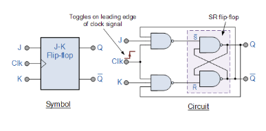

# Theory:

Counter is a type of circuit, which counts or which can be used for counting purposes. Counter is a sequential logic circuits composed via wiring together flip-flops, which are used to count binary pulses being applied on these flip-flops. When clock pulses are applied on input of some counters, the flip-flops present inside the counter change its state in such a way that stored binary number on it reveals the number of input pulses passing through it.
There are two types of counters in digital logic circuit and these types depend upon the clock pulses applied to the flip flops.

- ### Asynchronous Counter (Ripple Counter)

These are the counters in which we do not use universal clock, main clock is only applied to the first flip flop and then for rest of flip flops the output of previous flip flop is taken as a clock.

- ### Synchronous Counter

These are the counters in which we use a universal clock that is common to all flip flops. 

Main Differences between Ripple Counter and Synchronous Counter is as below.

## Counter behaviour 

- ### Counting: 

A counter increments its stored value with each qualified clock pulse, increasing or decreasing the count.
 
- ### Sequencing: 

The output of the counter follows a specific sequence, which can be a simple binary up/down sequence or a custom one depending on its design. 

- ### Modulus: 

A counter has a modulus (N) which is the number of unique states it cycles through before repeating. An n-bit counter has a maximum of 2n2 to the n-th power 2𝑛 states. 

- ### Overflow/Underflow: 

When a counter reaches its maximum value and is incremented, it resets to zero (overflow). When it reaches zero and is decremented, it resets to its maximum value (underflow). 

The basic building block of a counter is FlipFlop. We have already discussed FlipFlop design using S-R latch in detail in Section for Edge triggered FF. In this experiment we have used J-K FlipFlop and discussed mainly about J-K FlipFlop here.

A JK flip-flop is a clocked sequential logic circuit that acts as a bistable multivibrator, capable of storing a single bit of data and having two inputs, J and K, and two outputs, Q and its complement, Q-bar. It is a versatile and widely used digital memory element that overcomes the indeterminate state of an SR flip-flop by introducing the "toggle" function, where both inputs (J=1, K=1) cause the output to switch to its opposite state with each clock pulse

##### Figure 1: J-K FlipFlop

## Functionality

A JK flip-flop's behaviour depends on the inputs J and K and the clock signal: 

- J=0, K=0 (Hold/No Change): The flip-flop retains its previous output state, Q. 
- J=0, K=1 (Reset): The output Q becomes 0, and the output Q-bar becomes 1. 
- J=1, K=0 (Set): The output Q becomes 1, and the output Q-bar becomes 0. 
- J=1, K=1 (Toggle): The output Q switches to its opposite state (if it was 0, it becomes 1; if it was 1, it becomes 0) with each active clock edge. 
