# Theory:

Counter is a type of circuit, which counts or which can be used for counting purposes. Or counting is such a digital device, which counts clock pulses in binary. Counter is a sequential logic circuits composed via wiring together flip-flops, which are used to count binary pulses being applied on these flip-flops. When a clock pulses are applied on input of some counter, the flip-flops present inside the counter change its state in such a way that stored binary number on it reveals the number of input pulses passing through it.

There are two types of counters in digital logic circuit that are used to count the numbers of bits and these types depends upon the clock pulse applied to the flip flops.

- Asynchronous Counter (Ripple Counter)

These are the counters in which we do not use universal clock, main clock is only applied to the first flip flop and then for rest of flip flops the output of previous flip flop is taken as a clock.

- Synchronous Counter

These are the counters in which we use a universal clock that is common to all flip flops. 

## Ripple (Asynchronous Counter)

To design a ripple counter, we should first design a J-K Flip Flop. To design a J-K flip flop, we have to first design a 3 input NAND gate and a LATCH. We have designed 3 input NAND gate and LATCH as below and packaged them into components.

    

##### 3-IN-NAND (27, 28, 29: inputs. 30: Output)  		

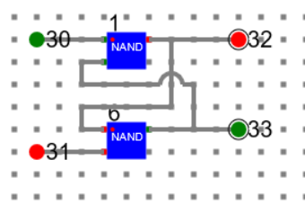

##### LATCH

Using the 3-In-NAND and LATCH, we have designed J-K-FlipFlop as below. Then packaged it into component.

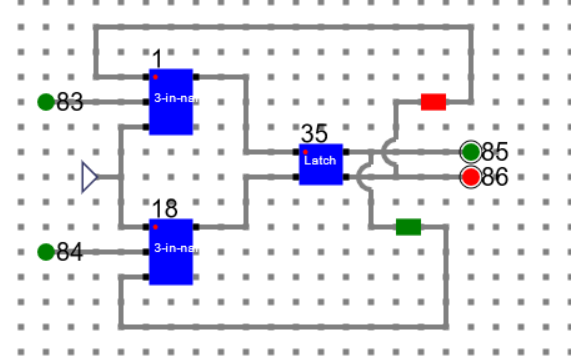

##### J-K-FlipFLop (83, 84: Inputs. 85, 86: Outputs)

Now using the J-K-FlipFLop, we have designed the ripple counter as below.

## 3 Bit Ripple Counter
***LSB: 191 MSB: 193***

### Clock 1: 

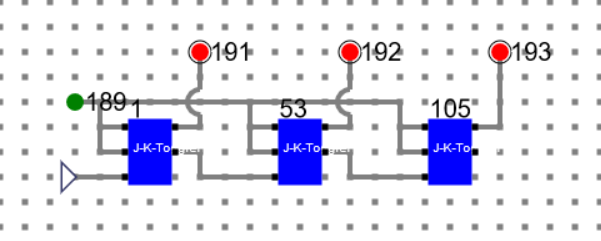

##### Number: 000

### Clock 2:

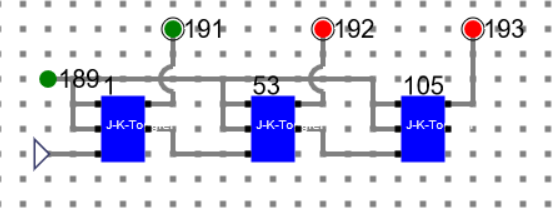

##### Number: 001

### Clock 3:

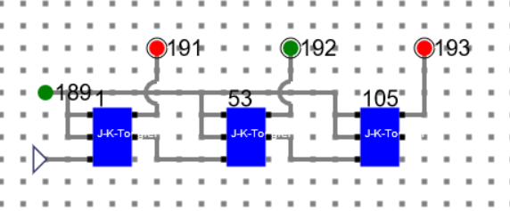

##### Number: 010

### Clock 4:

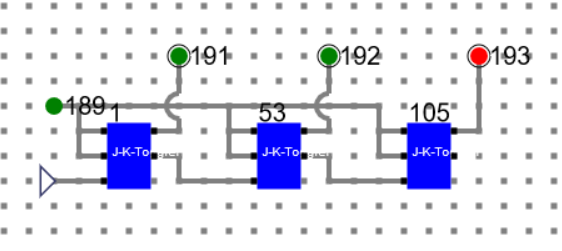

##### Number: 011

### Clock 5:

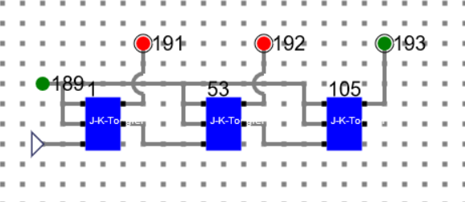

##### Number: 100

### Clock 6:

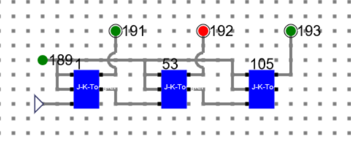

##### Number: 101

### Clock 7:

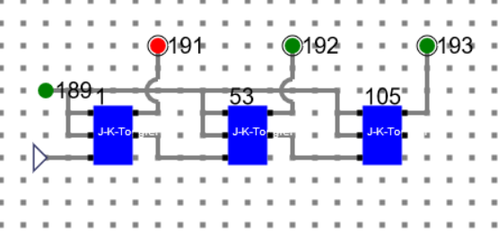

##### Number: 110

### Clock 8:

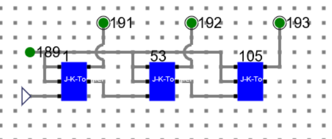

##### Number: 111

### Clock 9: (Back to initial state)

##### Number: 000

## 3-Bit synchronous Counter

Using J-K-FlipFlop and AND gate we can design asynchronous counters as below.

***204: LSB, 206: MSB***

### Clock 1:

##### Number: 111

### Clock 2:

##### Number: 110

### Clock 3:

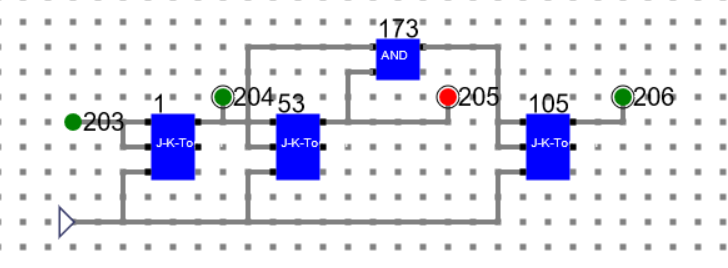

##### Number: 101

### Clock 4:

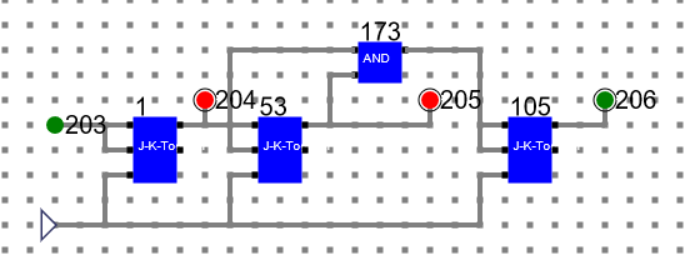

##### Number: 100

### Clock 5:

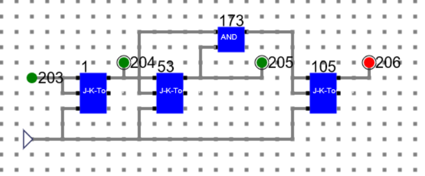

##### Number: 011

### Clock 6:

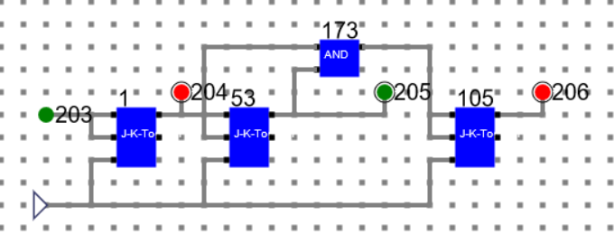

##### Number: 010

### Clock 7:

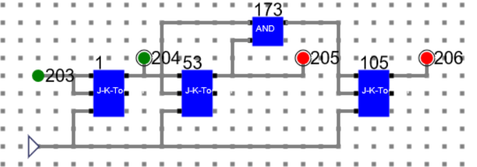

##### Number: 001

### Clock 8:

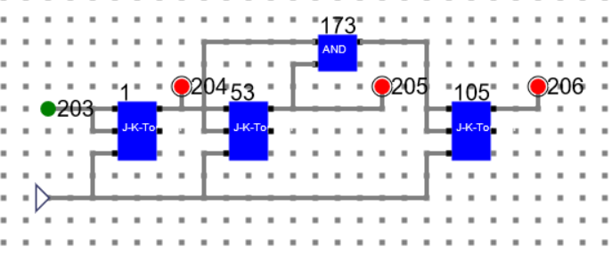

##### Number: 000

### Clock 9: (Back to initial state)

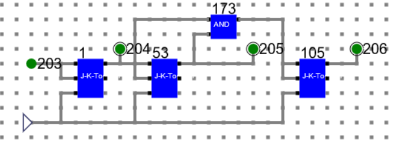

##### Number: 111

